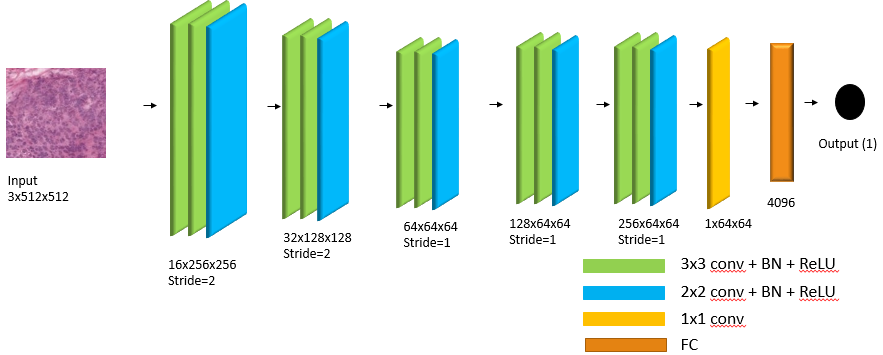

# LUPI
**Learning using Privileged Information for Chemosensitivity Prediction in Ovarian Cancer Patients.**

Whole slide images (WSI's) and gene expression data is taken from GDC Data Portal. Whole slide images can be download from [here](https://portal.gdc.cancer.gov/repository?facetTab=files&filters=%7B%22op%22%3A%22and%22%2C%22content%22%3A%5B%7B%22op%22%3A%22in%22%2C%22content%22%3A%7B%22field%22%3A%22cases.project.program.name%22%2C%22value%22%3A%5B%22TCGA%22%5D%7D%7D%2C%7B%22op%22%3A%22in%22%2C%22content%22%3A%7B%22field%22%3A%22cases.project.project_id%22%2C%22value%22%3A%5B%22TCGA-OV%22%5D%7D%7D%2C%7B%22op%22%3A%22in%22%2C%22content%22%3A%7B%22field%22%3A%22files.data_type%22%2C%22value%22%3A%5B%22Slide%20Image%22%5D%7D%7D%2C%7B%22op%22%3A%22in%22%2C%22content%22%3A%7B%22field%22%3A%22files.experimental_strategy%22%2C%22value%22%3A%5B%22Tissue%20Slide%22%5D%7D%7D%5D%7D). 
ID’s of each WSI used in this project is available in ‘imgs.csv’ file.
To train and validate the models one would need tiles extracted from WSIs, gene expression profiles and their respected labels for each patient. 

**1-Preprocessing:** WSI’s are very large in size and it is difficult to process the entire image. So, we did extract the top 3 tiles from each slide. Preprocessing code can be downloaded from here. This tutorial contain three files ‘slide.py’, ‘filter.py’ and ‘tiles.py’.

Before executing ‘slide.py’ file, add path to WSIs directory and the directory where you want to save the tiles on line 32,143 and 751. This file will create low resolution image of each whole slide image. No changes required in ‘filter.py’ file. In file ‘tiles.py’ change the size of tile to 1536x2048 and top tiles to 3 on line 38, 39 and 40 respectively. After this modification code can be executed to generate top 3 tiles from each WSI. Slide.py->filter.py->tiles.py

After preprocessing step one will have top 3 tiles for each patient. Add these tiles path to ‘imgs.csv file’.

**2-Data files:** This folder contain following three files:

  I.	imgs.csv 
  
  II.	genes.csv
  
  III.	labels.csv

imgs.csv: This file contains path to tiles for each patient used in this project and which need to be updated as per your local path.
gene.csv: In this file each column represent patient’s gene profile, which is already preprocessed as discussed in paper.
labels.csv: This file contain labels (-1,1) for each patient. -1 represent chemo-resistant and +1 represent chemo-sensitive patients

NOTE: gene.csv and labels.csv files have data in same sequence as imgs.csv file have patient ID’s which will be used later for training. Also change the local path to tiles directory in imgs.csv file as needed.

**3-Stain normalization:** Tiles extracted from WSIs needed to be stain normalized to remove the color variations. To do that update the local paths in ‘normalization.py’ and execute it.

So by now you will have all data required to train and validate the models. Each model will use ‘imgs.py’, ‘genes.py’ and ‘labels.py’ file to load the data so make sure you update the local paths in ‘imgs.py’ file.

To train the model simply execute the model file e.g. privileged_model.py and also one can use the ‘testing.py’ file to use the already trained model.

